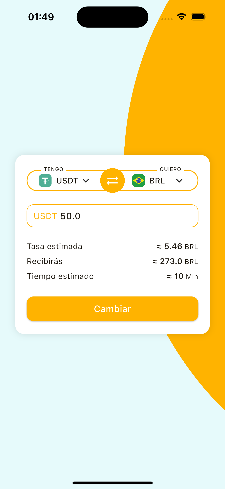

# 💱 coding-interview-frontend

## 📱 Descripción

Calculadora de tipo de cambio desarrollada con **Flutter 3** y [**Riverpod**](https://pub.dev/packages/riverpod), ejecutada en simulador **iOS 17.0 (iPhone 15 Pro)** y también testeada en versión **web**.

---

## 🧠 Consideraciones

El diseño original incluía un botón llamado **"Cambiar"**, pero decidí dejarlo sin funcionalidad, ya que el cálculo se realiza automáticamente con cada interacción del usuario:

- ✅ Cambiar las monedas en los campos **"Tengo"** y **"Quiero"**
- 🔁 Intercambiar ambas monedas con el botón central
- ⌨️ Ingresar un nuevo valor y presionar **Enter**

> 💡 Consideré que este flujo simula una etapa previa a una transacción, y el botón **"Cambiar"** podría utilizarse en una segunda etapa para confirmar.

---

## 🗂️ Capturas

En la raíz del proyecto se encuentra una carpeta llamada [`CAPTURAS`](./CAPTURAS), que contiene registros visuales y videos de funcionamiento.

| Pantalla de inicio       | Selector FIAT                     | Selector Cripto                     |
| ------------------------ | --------------------------------- | ----------------------------------- |
|  |  |  |

---

## 🎞️ Animación (Descartada)

En un principio implementé una animación para el intercambio de monedas al presionar el botón central. Sin embargo, al finalizar el desarrollo noté que no era compatible con la lógica de estado existente, y por cuestiones de tiempo decidí removerla.

Podés ver una demostración de esa funcionalidad aquí 👉 [Animación.mov](./CAPTURAS/Animacion.mov)

---

## 🙋‍♂️ Autor

👤 [Joaquín Nievas](https://www.linkedin.com/in/joaquin-nievas-a4b668147/)

---
